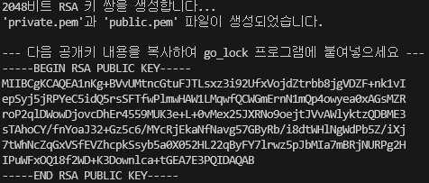
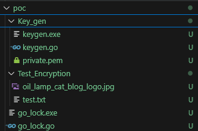
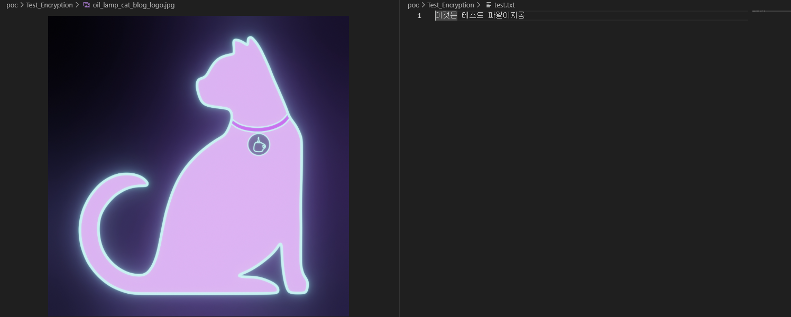
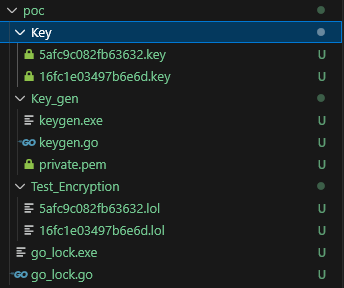
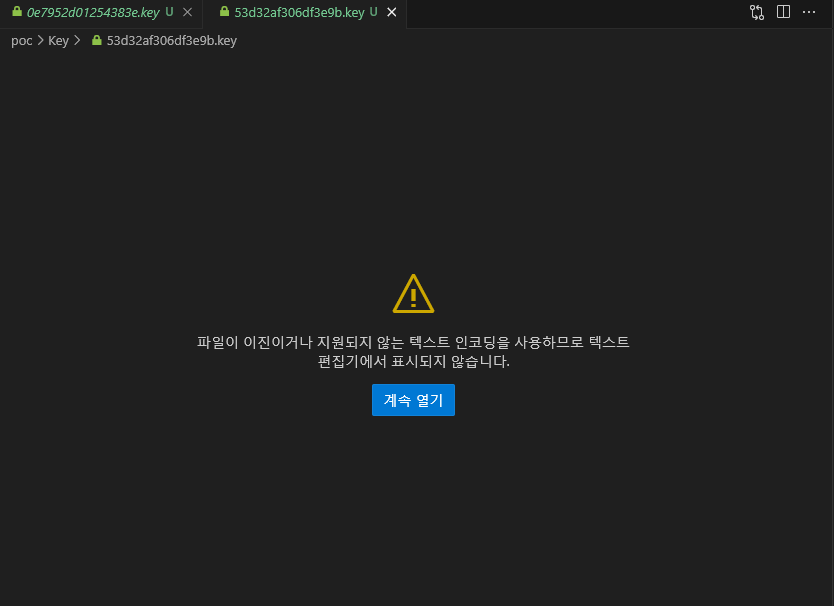
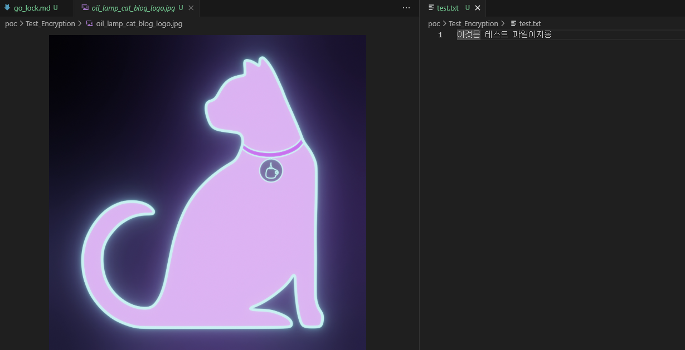

# GO 언어로 만드는 malware

개발을 시작하기에 앞서 필자는 go 언어를 처음 써보는 것이기도 하여 기본적인 설정법에 대해서 부터 시작하도록 하겠다.

## 1. Go 개발 환경 설정 (Windows + VS Code 기준)

필자는 **Windows** 운영체제와 **Visual Studio Code (VS Code)** 에디터를 기준으로 설명하므로, 다른 환경을 사용한다면 자신의 환경에 맞춰 추가적인 검색이 필요할 수 있습니다.

### 1.1. Go 설치

가장 먼저 Go 언어를 공식 홈페이지에서 설치해야 합니다.

1.  **다운로드**: 공식 홈페이지 **[go.dev](https://go.dev/dl/)** 에 접속하여 **Windows용 MSI 설치 파일**을 다운로드하여 실행합니다.
2.  **설치**: 설치 과정은 특별한 설정 없이 'Next'를 눌러 진행하면 됩니다. 설치 프로그램이 알아서 환경 변수(`PATH`)까지 설정해 주므로 매우 편리합니다.
3.  필자는 설치 과정에서 크롬 익스텐션인 `Chrome Remote Desktop`과 관련하여 여러 알림창이 떳지만 일단 무시하고 진행했다. 읽어보니 딱히 큰 오류가 발생할 문제는 아닌 것으로 확인되었다.

### 1.2. 설치 확인

Go가 올바르게 설치되었는지 확인합니다. `cmd`나 `PowerShell`을 열고 아래 명령어를 입력하세요.

```bash
go version
```

아래와 같이 설치된 Go의 버전 정보가 출력되면 성공입니다.

```bash
C:\Users\user>go version
go version go1.25.0 windows/amd64
```

### 1.3. Visual Studio Code (VS Code) 설정

코드를 작성하고 편집할 에디터를 설정합니다.

1.  **Go 확장 프로그램 설치**: VS Code를 실행한 뒤, 왼쪽 사이드바에서 Extensions 탭에 들어가 검색창에 `Go`를 검색하여 **Go Team at Google**이 만든 공식 확장 프로그램을 설치합니다.


2.  **Go 필수 도구 설치**: 확장 프로그램 설치 후, VS Code 오른쪽 하단에 Go 관련 도구들을 설치하라는 알림이 나타날 수 있습니다. **Install All** 버튼을 눌러 모두 설치해 주세요. `gopls`(언어 서버), `dlv`(디버거) 등 코딩에 도움이 되는 필수 도구들입니다.

필자는 2번을 건너뛰었다가 오류가 계속 발생하여 뭔가 싶었다는 비밀.

### 1.4. 프로젝트 폴더 설정 및 테스트

이제 모든 준비가 끝났으니 첫 프로젝트를 설정하고 테스트 코드를 실행해 봅시다.

1.  **프로젝트 폴더 생성**: 원하는 위치에 `go-malware`와 같은 이름의 새 폴더를 만듭니다. 참고로 지금 하는 프로젝트는 멀웨어를 직접 만들어보는 작업이기에 폴더의 이름이 저러하다.

2.  **VS Code에서 폴더 열기**: VS Code에서 `File` -> `Open Folder...`를 선택하여 방금 만든 폴더를 엽니다.

3.  **테스트 파일 생성**: `main.go`라는 이름의 새 파일을 만들고 아래 코드를 붙여넣습니다.

    ```go
    package main

    import "fmt"

    func main() {
        fmt.Println("Development environment is ready!")
    }
    ```

4.  **Go 모듈 초기화**: VS Code 내장 터미널(`Terminal` -> `New Terminal`)을 열고 아래 명령어를 실행하여 Go 프로젝트를 초기화합니다.

    ```bash
    go mod init go-malware
    ```

5.  **실행**: `main.go` 파일의 `func main()` 코드 위를 보면 나타나는 `run file`을 클릭하거나, `F5` 키를 눌러 코드를 실행합니다.

터미널 창에 `Development environment is ready!` 라는 메시지가 출력되면, 악성코드를 개발할 모든 준비가 성공적으로 끝났다.

그리고 찾아보니 [Go 개발을 위한 Visual Studio Code 설치 및 구성](https://learn.microsoft.com/ko-kr/azure/developer/go/configure-visual-studio-code)이라는 문서로 microsoft에서 만든 심지어 사진까지 잘 나와있는 설명서가 있었다. 이런!

마지막으로 터미널 창에서 출력물을 볼 때에 `출력`이 아니라 `디버그 콘솔`로 들어가서 볼 수 있다.

## 2. 실제로 구현해보자

## Keygen.go, private키와 public 키를 생성하기

하이브리드 암호화를 하기 위해서는 private키와 public 키를 생성하여 이 둘을 이용해 암호화를 진행해야 하기에 그를 위한 코드를 구현하였다.

[go_lock/keygen.go](https://github.com/GRAPE-SEC/QuokkaTheLock/tree/poc/go-lock/poc/Key_gen/keygen.go)

처음 해보는 go 언어라 꽤나 애를 먹었지만 하다보니 언어들이 다들 비슷비슷하기는 하다보니 어느정도 할 만 하달까? 대신 틀리는 부분이 있을 수 있다는 점...



keygen 코드를 실행시켜보면 위 사진과 같이 `public`키와 `private` 키를 생성하게 된다. 그리고 그 생성된 파일 중 `public`키를 이후에 나올 `go_lock.go`에 하드코딩하여 박아넣으면 된다.

`public`키는 상대방에게 줘도 되는 키고 `private`키는 공격자인 내가 가지고 있어야 하는 키로 후에 암호화를 복호화 하여 파일을 살려낼 때에 `private`키를 사용하게 된다.

## go_lock.go, 실행되는 실질적인 공격자

이제 키들을 전부 세팅하고 나서 이 프로그램이 실행되게 된다.

[go_lock/go_lock.go](https://github.com/GRAPE-SEC/QuokkaTheLock/tree/poc/go-lock/poc/go_lock.go)


사용법은 위와 같이 인자를 이용하여 암호화를 하거나 복호화를 수행할 수 있게 하였다.

## 실습



현제 실습을 위한 파일에서는 위와 같이 파일들이 구현되어있다. 참고로 지금 아예 하드코딩하여 `go_lock`을 구현하였기에 한 사람에게 밖에 쓸 수 없다는 사실! 뭐 필요하다면 피해자의 컴퓨터에서 실행 될 때 자동으로 private 키나 public 키를 만들어내서 그 때 private 키를 내게 혹은 lots로 혹은 c2로 보내면 되겠지만 그 경우 중간에서 가로체면 말짱 도로묵 아닌가 하는 생각도 들고... 그래서 이번에는 하드코딩하여 구현했다.



이번에 암호화할 파일들은 `Test_Encryption`에 들어있는 이미지 파일과 텍스트 파일이다.


위에서도 말했지만 사용법은 이렇게 된다. 지금은 build 작업을 거쳐 이미 `.exe`로 만든 상태이다.


암호화를 시작하면



이렇게 Test_Encryption에 들어있던 파일들은 내가 설정해둔 `.lol`이라는 확장자로 변함과 동시에 랜덤으로 생성된 이름으로 변경되며 그에 따른 `Key` 파일들 또한 생성된다.



게다가 위와 같이 어떤 파일들이 암호화 된 것인지도 확인할 수 없기에 private키를 이용해서만 복호화 할 수 있다.


이런 식으로 복호화가 가능하며 다시 파일들을 열어보면



다시 매우 정상적으로 돌아왔음을 알 수 있다.

## 이후에 해볼 것들

이후엔 gui창을 띄우던가 아니면 공격자인 내가파일들을 가져갈 수 있게 lots를 좀 더 구현하는 것을 하게 될 예정이다.